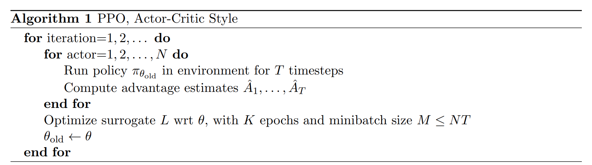

# PPO Algorithm for CartPole in NVIDIA Omniverse Isaac Gym Environment
This repository demonstrates how to install, build a basic task, and then build an RL agent (here is PPO) to train CartPole environments in parallel and concurrently based on Omniverse IsaacGym.

# "Why Omniverse IsaacGym?"
Omniverse Isaac Gym provides an advanced learning platform designed for efficiently training policies across diverse robotics tasks directly on GPU. The platform ensures high performance by executing both physics simulation and neural network policy training on the GPU. This is achieved through the direct transfer of data from physics buffers to PyTorch tensors, bypassing any CPU bottlenecks. As a result, the training times for complex robotics tasks are remarkably fast on a single GPU, with improvements ranging from 2 to 3 orders of magnitude when compared to conventional RL training setups that utilize a CPU-based simulator and GPU for neural networks.{https://arxiv.org/abs/2108.10470}

# How to install Omniverse Isaac Gym?
Please follow the instructions in the following link to install it. {https://docs.omniverse.nvidia.com/isaacsim/latest/installation/install_workstation.html#workstation-setup}

# How to create a new RL Example (CartPole) in OmniIsaacGymEnvs
Please follow the instructions in the following link: https://docs.omniverse.nvidia.com/isaacsim/latest/isaac_gym_tutorials/tutorial_gym_isaac_gym_new_oige_example.html

# Build a Deep RL Agent (Proximal Policy Optimization (PPO))
* PPO_Buffer:
  
  The buffer includes the following tensors:
  - states: (buffer_size, num_envs, obs_dim)
  - actions: (buffer_size, num_envs, act_dim)
  - rewards: (buffer_size, num_envs, 1)
  - terminated: (buffer_size, num_envs, 1)
  - log_prob: (buffer_size, num_envs, 1)
  - values: (buffer_size, num_envs, 1)
  - returns: (buffer_size, num_envs, 1)
  - advantages: (buffer_size, num_envs, 1)
* MPL NN:
  The structure of neural networks (NN) is defined as follows:

    - Policy Network:
      - net = nn.Sequential(nn.Linear(num_observations, 32),
                          nn.ELU(),
                          nn.Linear(32, 32),
                          nn.ELU())
      - mean_layer = nn.Linear(32, num_actions)
      - log_std_parameter = nn.Parameter(torch.zeros(num_actions))

    - Value Network:
      - value_layer = nn.Linear(32, 1) (using the shared net with policy network)

  The policy network is composed of 4 layers: 2 linear layers with 32 neurons each, and 2 activation layers with ELU activation function. The mean_layer and log_std_parameter are used to calculate the mean and standard deviation of the output actions. The value network is composed of a single linear layer with 32 neurons, which is shared with the policy network, and a final output layer with 1 neuron.

* PPO Algorithm:
  The PPO Algorithm is clearly presented in this paper (https://arxiv.org/abs/1707.06347).

  
  
  - The parameters of the PPO algorithm are presented below:
    
    - cfg["rollouts"] = 16  # memory_size
    - cfg["learning_epochs"] = 8
    - cfg["mini_batches"] = 1  # 16 * 512 / 8192
    - cfg["discount_factor"] = 0.99
    - cfg["lambda"] = 0.95
    - cfg["learning_rate"] = 3e-4
    - cfg["learning_rate_scheduler"] = AdaptiveLR (refer to rl_games)
    - cfg["learning_rate_scheduler_kwargs"] = {"kl_threshold": 0.008}
    - cfg["random_timesteps"] = 0
    - cfg["learning_starts"] = 0
    - cfg["grad_norm_clip"] = 1.0
    - cfg["ratio_clip"] = 0.2
    - cfg["value_clip"] = 0.2
    - cfg["clip_predicted_values"] = True
    - cfg["entropy_loss_scale"] = 0.0
    - cfg["value_loss_scale"] = 2.0
    - cfg["kl_threshold"] = 0
    - cfg["rewards_shaper"] = lambda rewards, timestep, timesteps: rewards * 0.1

# Training:

- Graphic mode:
```python
python train.py num_envs = 512
```

- Headless mode:
```python
python train.py headless=True num_envs = 512
```

- To display the results on the Tensorboard:
```python
tensorboard --logdir=./runs/torch/Cartpole/
```

# Results:
|_|_|
|:---:|:---:|
| |
|:---:|:---:|
| |

# References:

  
    


